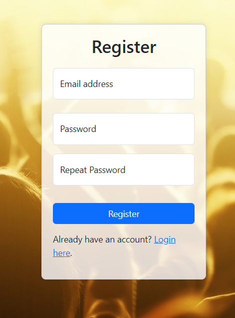

# Music app

- This application is designed so the users of it can add, edit and delete songs.
- Using Youtube's api when creating songs you just paste the youtube URL in and get your song posted.
- Users can log in and register so they have the full functionality of the site, guests can only see other song post.

This project uses [React](https://react.dev/) with the [Vite](https://vitejs.dev/) Template

# Instructions when downloading or cloning this repo

There are two folders (client) and ([server](https://github.com/softuni-practice-server/softuni-practice-server/tree/master))

For the client folder you do

- npm i
- npm run dev

For the server folder you do

- node server.js

# Images of the website

- **Home Page For Guests**
  
- **Home Page For Users**
  

- **Login Form**
  
- **Login Form Validation**
  

- **Register Form**
  
- **Register Form Validation**
  

- **Create Song Form**
  
- **Create Song Form Validation**
  

- **Empty User Info**
  
- **Filled User Info**
  

- **Community Page**
  

- **Song Details Not Owner Of Song**
  
- **Song Details Owner Of Song**
  

- **Create Song Form**
  
- **Create Song Form Validation**
  

- **Delete Song Modal**
  

- **Edit Song Form**
  
- **Edit Song Form Validation**
  

- **Community Loading Spinner**
  

- **User Info Loading Spinner**
  
